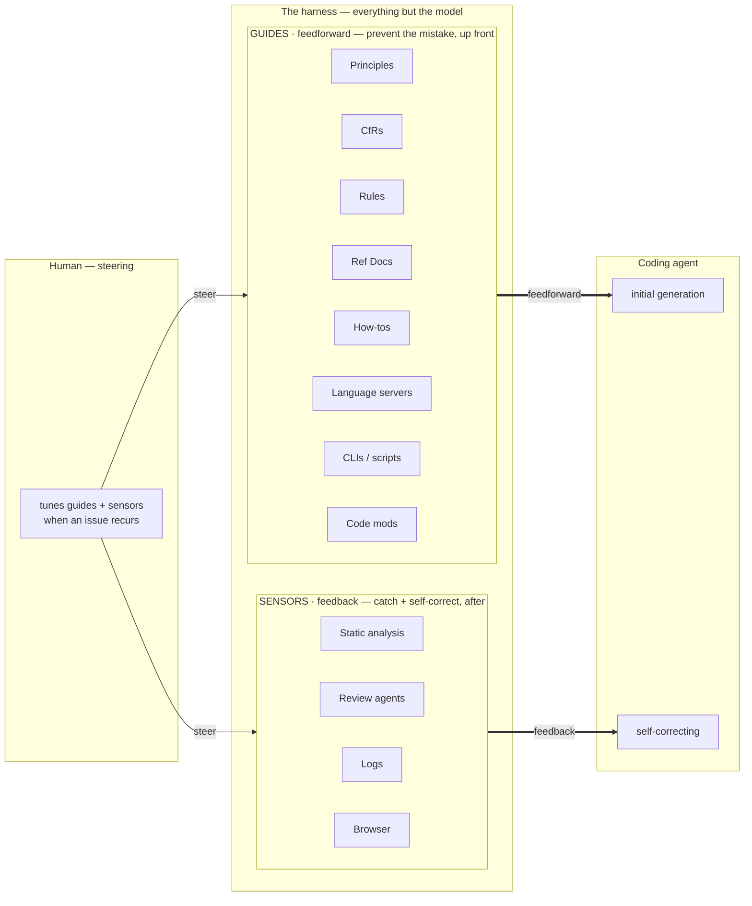
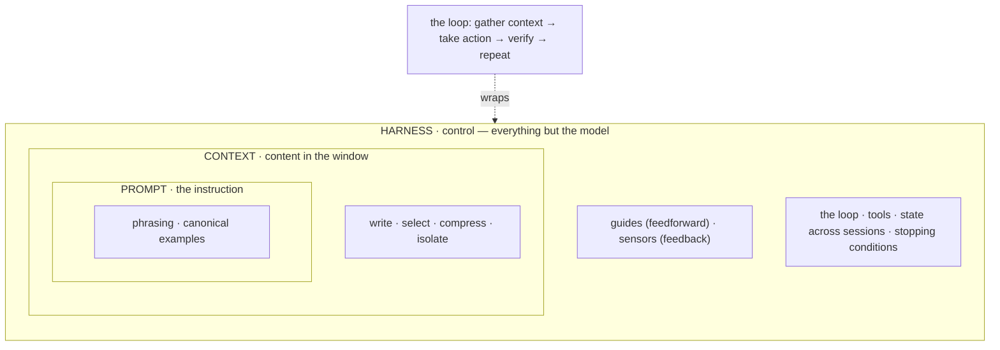

# Two reading journeys into agent engineering

I spent a while building software with coding agents before I went looking for writing that would organize how I was doing it. Two bodies of work did the most for me. They cover the same question — how do you get reliable work out of a coding agent over a long horizon? — from two vantage points:

- **Birgitta Böckeler's harness-engineering series** on Martin Fowler's site — a practitioner's synthesis, grounded in cybernetics — the study of how systems steer themselves by feeding their output back as correction.
- **Anthropic's engineering posts** on building agents — the model vendor's own notes, close to the source.

This is a map of what each says and where they meet. Both are public; links are at the end. If you read one thing from each, read Böckeler's *Harness Engineering* and Anthropic's *Building Effective Agents*.

---

## Journey A — Böckeler: a harness is guides + sensors

Böckeler's frame is a single picture. An agent's **harness** is everything around the model that shapes and checks its work, and it splits cleanly in two:

- **Guides — feedforward.** Context you supply *before* generation to prevent a mistake. Open-loop: it shapes the first attempt.
- **Sensors — feedback.** Signals you read *from the output* to drive correction. Closed-loop: it catches what the guides didn't prevent.

She calls harness engineering "a specific form of context engineering," and grounds it in Ashby's Law of Requisite Variety: a regulator must carry at least as much variety as the system it governs. So the controls come in two textures — **inferential** (soft, judgment-based: natural-language guidance the agent interprets, or an LLM that judges) and **computational** (hard, deterministic: exact facts and transforms from tooling). You reach for deterministic where the rule is mechanical, and inferential where it isn't.

**The guides (feedforward).**

- **Principles** — high-level values that bias decisions.
- **CfRs** — cross-functional requirements, the "-ilities": performance, security, accessibility, observability.
- **Rules** — concrete do/don't constraints.
- **Ref Docs** — reference material the agent reads.
- **How-tos** — step-by-step procedures.
- **Language servers** — LSP semantic facts: definitions, references, types.
- **CLIs and scripts** — the command tools the agent runs.
- **Code mods** — AST bulk transforms: migrate once, apply to N files.

The first five are inferential; the last three are computational.

**The sensors (feedback).**

- **Static analysis** — lint, type-check, security scan, without running the code.
- **Review agents** — LLM sub-agents that read the output.
- **Logs** — runtime traces the agent reads back.
- **Browser** — an automated browser observing real behavior.

Only the review agents are inferential; the rest are deterministic.

The last piece is the human. You sit outside the loop and **tune the controls when an issue recurs** — refine a guide, or add a sensor. Böckeler's guidance on where you belong: "a good harness should not necessarily aim to fully eliminate human input, but to direct it to where our input is most important."

### The rest of the series

The harness picture is the anchor; Böckeler's surrounding articles fill it in.

- **Context Engineering for Coding Agents** catalogs the feedforward mechanisms concretely — for Claude Code, that's CLAUDE.md, path-scoped rules, slash commands, skills, subagents, MCP, and hooks. It draws a useful line between *Instructions* (do this specific thing this way) and *Guidance* (general conventions).
- **How far can we push AI autonomy?** argues that full, unsupervised autonomy isn't yet feasible for production business software, and reframes the goal: don't chase autonomy, *make the loop go faster by speeding up human verification*. Its catalog of failure modes is worth the read on its own — especially **false success claims**, where an agent reports the tests pass when they don't.
- **Understanding Spec-Driven Development** places the "spec before code" tools on a spectrum — spec-first (the spec is discarded after), spec-anchored (it persists and evolves), and spec-as-source (the spec is primary and code is generated from it) — and is honest about the costs, including *false control*: a spec you never verify the result against doesn't actually control anything.

One more from the same site — not Böckeler's, but squarely adjacent:

- **Humans and Agents in Software Engineering Loops** (Kief Morris) names three postures: humans **out** of the loop (vibe coding), **in** the loop (line-by-line inspection — the bottleneck), and **on** the loop (you engineer the harness — specs, checks, guidance — and steer). It also names the **agentic flywheel**: agents improve their own harness from performance signals while humans keep steering.

---

## Journey B — Anthropic: definitions, patterns, the loop

Where Böckeler gives you the practical catalog, the Anthropic engineering posts give you the definitions, the named patterns, and the *why*.

### Definitions

**Building Effective Agents** draws the line most of the field now uses:

- A **workflow** is LLMs and tools orchestrated through *predefined code paths* — you own the steps, and it's predictable.
- An **agent** *dynamically directs its own process and tool use* — "LLMs using tools based on environmental feedback in a loop."

Use a workflow when the task decomposes into fixed subtasks; reach for an agent on open-ended problems where you can't predict the path — and, they add, only in trusted environments with guardrails. The overarching advice: start with the simplest thing that works and add agentic structure only when simpler approaches fall short.

The **Claude Agent SDK** post names the loop underneath all of it: **gather context → take action → verify work → repeat.** Every other article is a facet of one of those legs.

### Prompt engineering, then context engineering

The **prompt engineering** overview is the foundation: name the task, identify the audience, and define what "done" means *before* generation; then clarity, examples, structure, and prompt chaining.

**Effective Context Engineering for AI Agents** marks the shift. Prompt engineering is writing the instructions — a discrete act. Context engineering is "curating and maintaining the optimal set of tokens during inference" — something you do every turn. The reason it matters is **context rot**: as tokens accumulate, the model's ability to recall accurately degrades. Context is a finite resource, so the maxim is "the smallest possible set of high-signal tokens that maximize the likelihood of the desired outcome." For long tasks it names three techniques: **compaction** (distill history at high fidelity), **structured note-taking** (a persistent external memory the agent writes to), and **sub-agent architectures** (a focused agent returns a condensed summary to a coordinator).

**Writing Tools for Agents** covers the other half of context — the tools. It frames a tool as "a contract between deterministic systems and non-deterministic agents," and argues for designing the agent-computer interface for a forgetful, context-scarce caller: a few high-impact workflow tools rather than many thin API wrappers, clear names, and high-signal returns. **MCP** (Model Context Protocol) is the standard for how those tools and data sources reach the agent, turning an M×N integration problem into M+N.

### The five patterns

*Building Effective Agents* names five composable patterns. They're worth memorizing because most agent systems are combinations of them:

1. **Prompt chaining** — each call processes the previous output, with gates between steps.
2. **Routing** — classify the input, then send it to a specialized handler.
3. **Parallelization** — run work concurrently, either by *sectioning* (split independent subtasks) or *voting* (run the same task several times for confidence).
4. **Orchestrator–workers** — a lead model decomposes a task, delegates to workers, and synthesizes their results.
5. **Evaluator–optimizer** — one model generates, another critiques, in a loop until the result is good enough.

Alongside them, three principles: **simplicity**, **transparency** (show the planning steps), and a carefully crafted **agent-computer interface** (good tool docs and testing).

### The harness

Two posts go deep on running an agent over a long horizon.

- **Effective Harnesses for Long-Running Agents** starts from a hard fact: "each new session begins with no memory of what came before." The fix is environmental scaffolding — a progress file (features written as failing tests), a fresh-context re-orientation ritual (read the progress file, review git, run the end-to-end tests, *then* pick the next task), git commits for rollback, and end-to-end verification that tests the app like a real user. It also draws a clean boundary: **context is content** (what's in the window now) and **harness is control** (the loop, the verification, state across sessions, stopping conditions).
- **Harness Design for Long-Running Application Development** contributes the lever: a GAN-inspired split into **planner → generator → evaluator**. "Separating the agent doing the work from the agent judging it proves to be a strong lever." Subjective quality becomes gradable once you give the evaluator concrete criteria defined before implementation.

Two more round it out: **Building a Multi-Agent Research System** is orchestrator–workers in production (with the honest caveat that it costs far more tokens and that most coding work, with its shared context and interdependencies, is a poor fit); and **Scaling Managed Agents** decouples the reasoning "brain" from the execution "hands."

The scopes nest — prompt inside context inside harness — with the loop wrapping the whole thing:

---

## Where the two journeys meet

Read side by side, the two vocabularies line up:

| Böckeler | Anthropic |
|---|---|
| Guides (feedforward) | context + tools — the *gather* leg of the loop |
| Sensors (feedback) | verification + the evaluator — the *verify* leg |
| Human steers, tuning the controls | human oversight — guardrails + verification |
| Inferential vs computational controls | LLM-judged vs deterministic checks |
| "A form of context engineering" | prompt ⊂ context ⊂ harness |

The clearest overlap is on the feedback half. Böckeler's **sensors**, Anthropic's **evaluator–optimizer**, and the harness-design **evaluator** are the same idea from three directions: separate the agent that does the work from the agent that judges it, and give the judge concrete criteria. It's the most-emphasized point across the Anthropic set and the load-bearing half of Böckeler's chart.

In practice the two journeys are complementary rather than redundant. Böckeler gives the catalog — *what mechanisms exist and how they land in your editor*. Anthropic gives *the definitions, the named patterns, and why each move works*. Read together, you get both the parts list and the reasoning.

---

## A small worked example

I wanted to see the feedforward/feedback split as running code rather than a diagram, so I built a small pipeline in this repo, [pro-code](README.md). It runs **Frame → Plan → Implement**, and each phase hands off through a **grader** — a sensor, in Böckeler's terms. The one commitment it makes concrete is the split itself: each phase separates a **guide** (feedforward, domain-specific, swapped per profile) from a **grader** (feedback, agnostic). Two example services, both runnable, show it end to end — one where "done" means no cross-tenant data leak, one where it means no missed critical alert. The [coverage notes](COVERAGE.md) map each piece back to the elements above.

It also takes memory seriously. Anthropic's *Effective Context Engineering* names the general move for long tasks — **structured note-taking**: a persistent external memory the agent writes to and reads back, so progress survives a fresh context (Böckeler folds the same thing into context). The pipeline's **living docs** are a concrete proposition for what that memory is — a running `current-state`, `backlog`, `open-questions`, and a decision log the next session reads first. It's one implementation of the general idea: a specific segmentation of a project's memory, and then one step further — the loop **grades** the docs for currency alongside the code, so stale memory fails the gate instead of quietly misleading the next run. The principle says *keep external notes*; the living docs are a shape for them, and their currency is a checkable requirement.

It's one instance, not a framework — a way to hold the chart in your hands. The reading is the point; this is just where I put it down.

---

## Sources

**Journey A — Birgitta Böckeler and others · martinfowler.com:**

- [Harness Engineering for coding agent users](https://martinfowler.com/articles/harness-engineering.html) — the guides + sensors frame.
- [Harness engineering & agent feedback: AI coding sensors](https://www.thoughtworks.com/insights/blog/generative-ai/harness-engineering-agent-feedback-exploring-ai-coding-sensors) — the feedback half in depth.
- [Context Engineering for Coding Agents](https://martinfowler.com/articles/exploring-gen-ai/context-engineering-coding-agents.html) — the feedforward mechanisms cataloged.
- [How far can we push AI autonomy in code generation?](https://martinfowler.com/articles/pushing-ai-autonomy.html) — the autonomy ceiling and the failure modes.
- [Anchoring AI to a reference application](https://martinfowler.com/articles/exploring-gen-ai/anchoring-to-reference.html) — reference apps and the pattern-drift report.
- [Understanding Spec-Driven Development](https://martinfowler.com/articles/exploring-gen-ai/sdd-3-tools.html) — spec-first / anchored / as-source.
- [Humans and Agents in Software Engineering Loops](https://martinfowler.com/articles/exploring-gen-ai/humans-and-agents.html) (Kief Morris) — same site, adjacent read: out / in / on the loop; the agentic flywheel.

**Journey B — Anthropic Engineering:**

- [Building Effective Agents](https://www.anthropic.com/research/building-effective-agents) — workflow vs agent; the five patterns.
- [Prompt engineering overview](https://docs.anthropic.com/en/docs/prompt-engineering) — the foundation.
- [Effective Context Engineering for AI Agents](https://www.anthropic.com/engineering/effective-context-engineering-for-ai-agents) — context rot; the smallest high-signal set.
- [Writing Tools for Agents](https://www.anthropic.com/engineering/writing-tools-for-agents) — the agent-computer interface.
- [Model Context Protocol](https://www.anthropic.com/news/model-context-protocol) — the M×N → M+N connection standard.
- [Effective Harnesses for Long-Running Agents](https://www.anthropic.com/engineering/effective-harnesses-for-long-running-agents) — progress files; context (content) vs harness (control).
- [Harness Design for Long-Running Application Development](https://www.anthropic.com/engineering/harness-design-long-running-apps) — planner / generator / evaluator.
- [Building a Multi-Agent Research System](https://www.anthropic.com/engineering/multi-agent-research-system) — orchestrator–workers in production.
- [Building Agents with the Claude Agent SDK](https://claude.com/blog/building-agents-with-the-claude-agent-sdk) — the loop: gather context → take action → verify work → repeat.
